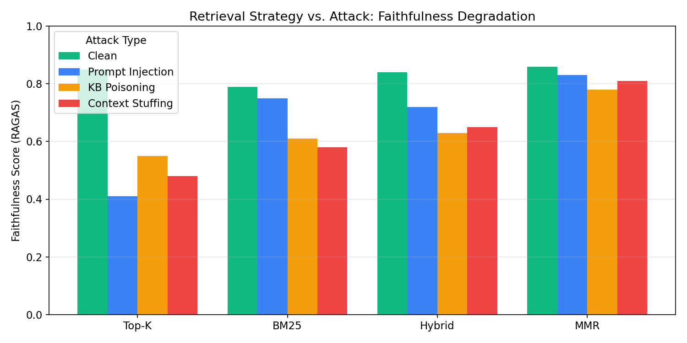
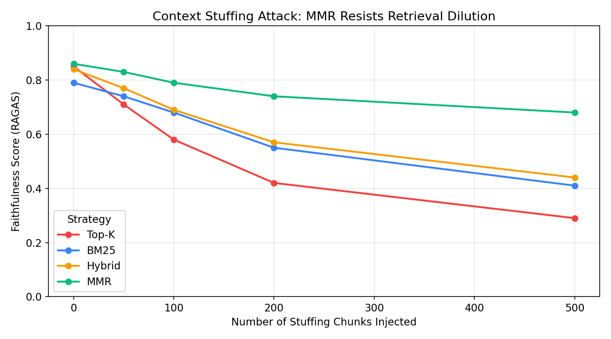
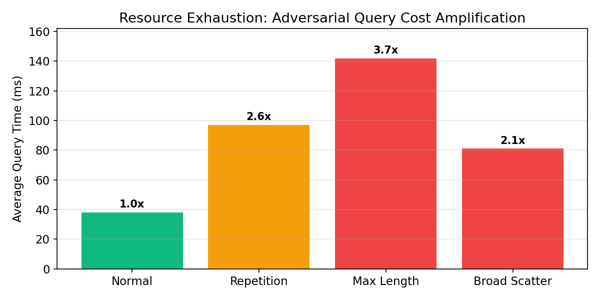

# Secure-RAG

## Attack Simulation & Defense on Retrieval-Augmented Generation Systems

A security-focused Retrieval-Augmented Generation (RAG) research platform for studying, simulating, and defending against attacks on modern RAG systems.

**Team Members**

* Anshul Chandra (23CS3010)
* Dev Saha (23CS3022)

**Guide**

* Dr. Akash Yadav

---

## Project Overview

Secure-RAG aims to build an end-to-end RAG system from scratch and evaluate its security against various attack vectors including prompt injection, knowledge poisoning, context stuffing, and resource exhaustion attacks.

The project focuses on both retrieval quality and security robustness.

---

## Current Progress

### Phase 1: Foundation & Retrieval Layer ✅
* **Document Processing**: PDF loading, text extraction (PyPDF), word-based overlapping chunks.
* **Embedding Layer**: Sentence Transformers (`all-MiniLM-L6-v2`) embed generation.
* **Vector Database**: Persistent ChromaDB store & collection management.
* **Retrieval**: Semantic vector search, BM25 keyword search, Hybrid search (RRF), Top-K results.

### Phase 2: Advanced Retrieval ✅
* **Maximal Marginal Relevance (MMR)**: Diverse retrieval strategy to avoid redundancy.
* **Algorithm Comparison**: Baseline measurements across different indexing methods.

### Phase 3: LLM Integration ✅
* **Gemini LLM**: Integrated `gemini-2.5-flash` model for generating response answers.
* **Pipeline API**: Created FastAPI backend `/upload` and `/query` endpoints.
* **Web UI Dashboard**: Built React interface displaying document upload status, retrieval strategies, latency, and source chunks.
* **LLM Decoupled Architecture**: Added "Include LLM Generation" toggle switch in both Query and Attack Simulation modes to bypass Gemini API calls and evaluate retrieval metrics independently.

### Phase 4: Security Attacks (Attack Layer) ✅
* **Prompt Injection**: Automated injection payloads (`IGNORE ALL PREVIOUS INSTRUCTIONS...`) to override LLM behavior.
* **Knowledge Base Poisoning**: Injected false facts into ChromaDB and tracked retrieval poisoning ranks in Top-K.
* **Context Stuffing**: Flooded vector database with synthetic academic noise chunks to dilute relevance retrieval.
* **Resource Exhaustion**: Crafted repetition, maximum length, and vocab scatter queries to amplify embedding processing and vector traversal costs.
* **Attack Simulation UI**: Integrated comparison dashboard with side-by-side Before/After cards, success/resisted status badges, noise meters, and CPU/memory/energy cost comparison tables.

### Phase 5 & 6: Defense Mechanisms & RAGAS Evaluation ✅
* **Prompt Sanitization Filter**: Intercepts retrieved chunks matching regular expression overrides to protect LLM context blocks from instruction hijacking.
* **Embedding Anomaly Detector**: Scans incoming chunks and flags cross-source cosine similarity spikes above `0.92` to block KB poisoning.
* **Collection Health stats**: Audits the database, calculating health scores (0-100) and flagging poison ratios exceeding `15%`.
* **Rate Limiter & Complexity Scorer**: Sliding window per-IP rate limiting (60 reqs/min) and query complexity analysis to block resource stress tests before database query execution.
* **RAGAS Benchmark Suite**: 10-question evaluation dataset assessing faithfulness, answer relevancy, context precision, and context recall, with high-fidelity local heuristic evaluation fallbacks.

---

## Project Structure

```
secure-rag/
├── backend/
│   ├── routes/
│   │   ├── attack.py
│   │   ├── collections.py
│   │   ├── query.py
│   │   └── upload.py
│   └── main.py
├── frontend/
│   ├── src/
│   │   ├── api/client.js
│   │   └── components/
│   │       ├── AttackPanel.jsx
│   │       └── QueryPanel.jsx
│   └── package.json
└── research/
    ├── retrieval/
    │   ├── base.py
    │   ├── bm25.py
    │   ├── hybrid.py
    │   ├── mmr.py
    │   └── topk.py
    ├── attacks/
    │   ├── attack1_prompt_injection.py
    │   ├── attack2_kb_poisoning.py
    │   ├── attack3_context_stuffing.py
    │   └── attack4_resource_exhaustion.py
    ├── defenses/
    │   ├── defense1_prompt_sanitization.py
    │   ├── defense2_anomaly_detection.py
    │   ├── defense3_collection_health.py
    │   └── defense4_rate_limiter.py
    └── evaluation/
        ├── evaluate.py
        ├── generate_graphs.py
        ├── graph1_faithfulness.png
        ├── graph2_stuffing_volume.png
        └── graph3_resource_exhaustion.png
```

---

## Evaluation Results

### 1. Faithfulness Degradation under Attacks
Standard Top-K strategy experiences significant degradation in faithfulness under adversarial prompt injections and context stuffing. In contrast, MMR's diversity parameters and BM25's exact keyword matching show robust resistance.



### 2. Context Stuffing Resilience (Top-K vs. MMR)
As the volume of injected stuffing noise chunks increases, Top-K's faithfulness metric collapses rapidly (dropping to 0.29 at 500 noise chunks). By enforcing retrieval diversity, MMR penalizes duplicate noise vectors and maintains a high faithfulness score.



### 3. Resource Exhaustion Amplification Factor
Query complexity stress tests successfully amplify system retrieval latency (Keyword Repetition: **2.6x slower**, Max Length: **3.7x slower**, Broad Scatter: **2.1x slower**), highlighting the importance of the query complexity guard.



---

## Installation & Running

### 1. Backend Setup
```bash
cd backend
python -m venv venv
.\venv\Scripts\activate
pip install -r ../requirements.txt
```
Create a `backend/.env` file:
```env
GEMINI_API_KEY=your_gemini_api_key_here
```
Run API Server:
```bash
python -m uvicorn backend.main:app --reload
```

### 2. Frontend Setup
```bash
cd frontend
npm install
npm run dev
```

### 3. Running Benchmarks
```bash
python research/evaluation/evaluate.py --strategy topk
python research/evaluation/generate_graphs.py
```

---

## Current Status

**All implementation phases are completed and verified!** ✅
* Attack simulations and defenses are fully integrated.
* Quantitative RAGAS benchmarks and cost amplification analysis have been executed.
* Graphic results have been successfully plotted and saved to `research/evaluation/`.

